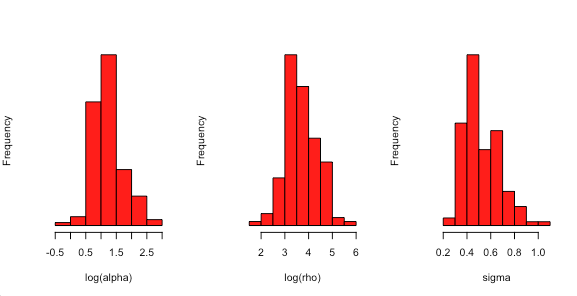
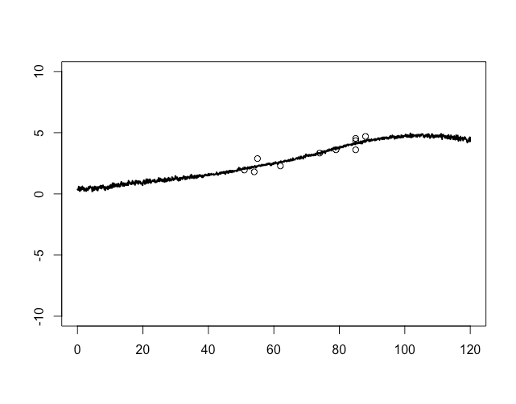
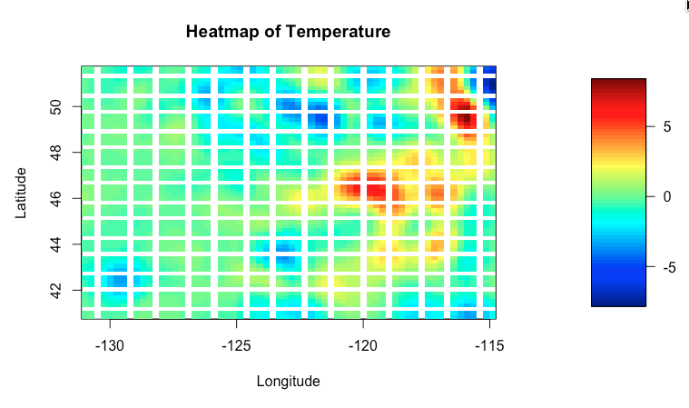
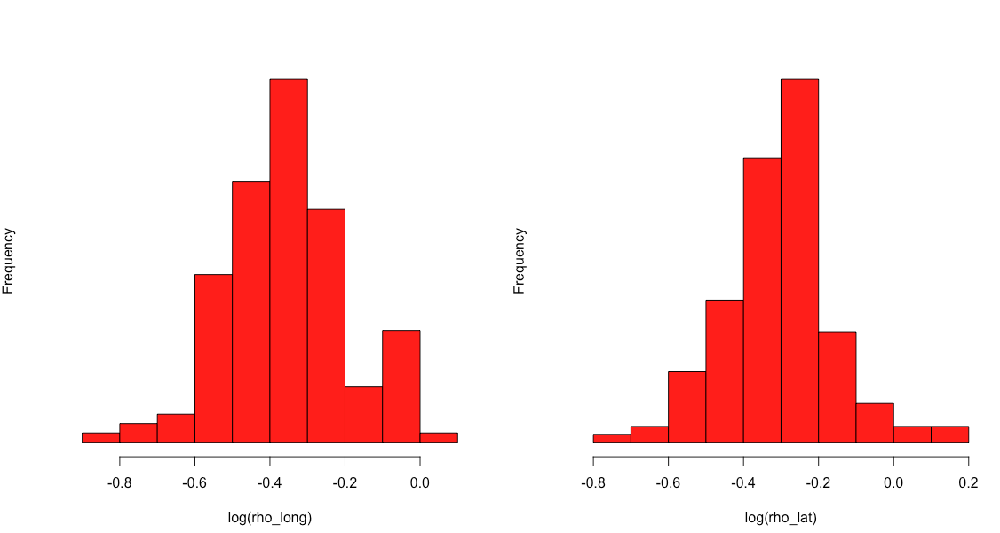
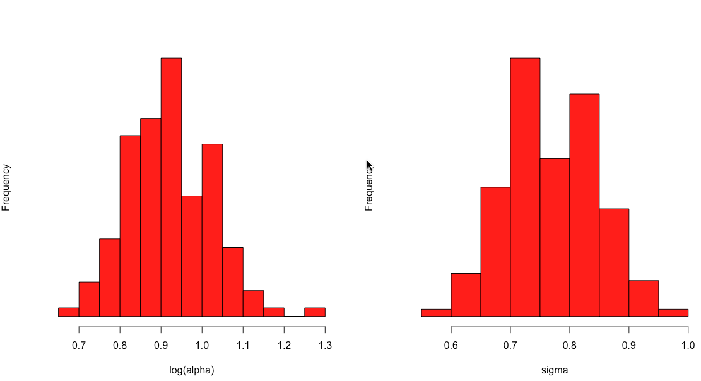

# Non-linear functions

## Regression View
So far, we've assumed our latent function is a linear function of our data -- which is obviously limiting. One way of circumventing this is to project our inputs into some high-dimensional space using a set of basis functions $\phi:\mathbb{R}^d\rightarrow \mathbb{R}^N$, and then performing linear regression in that space, so that

$$y_i = \phi(x)^T\beta + \epsilon_i$$

For example, we could project $x$ into the space of powers of $x$, i.e. $\phi(x) = (1,x,x^2,x^3\dots)$ to obtain polynomial regression.

  Let $\mathbf{y}$ and $\mathbf{X}$ be set of observations and corresponding covariates, and $y_*$ be the unknown value we wish to predict at covariate $\mathbf{x}_*$.  Assume that

  $$\begin{aligned}
    \beta \sim& \mbox{N}\left(0,\Sigma\right)\\
    \begin{bmatrix}f_* \\ \mathbf{f}\end{bmatrix} =& \begin{bmatrix}\boldsymbol{\phi}_*^T\\ \boldsymbol{\Phi}^T\end{bmatrix}^T\beta\\
      \begin{bmatrix}y_* \\ \mathbf{y}\end{bmatrix} \sim& \mbox{N}\left(\begin{bmatrix}f_* \\ \mathbf{f}\end{bmatrix},\sigma^2\mathbf{I}\right)
      \end{aligned}$$
  where $\boldsymbol{\phi}:=\phi(\mathbf{x})$ and $\boldsymbol{\Phi}:=\phi(\mathbf{X})$.

## Exercise 4.1

What is the predictive distribution $p(f_*|\mathbf{y},\mathbf{x}_*,\mathbf{X})$? Note: this is very similar to questions we did in Section 1.

Reference:
C. E. Rasmussen & C. K. I. Williams, Gaussian Processes for Machine Learning, the MIT Press, 2006,
ISBN 026218253X. c 2006 Massachusetts Institute of Technology. www.GaussianProcess.org/gpml

### Solution
From the multivariate Gaussian - Equation 2.9 from Rasmussen & Williams (2006) - we know that,
$$
p(f_*|\mathbf{y},\mathbf{x}_*,\mathbf{X}) \sim N(m, S)
$$
Where, 

$m = \frac{1}{ \sigma_n ^2} \mathbf{x}_*^T A^{-1} X\mathbf{y}, \mathbf{x}_*^TA^{-1}\mathbf{x}_*$

$S = \mathbf{x}_*^TA^{-1} \mathbf{x}_*$

$A = \sigma_n ^{-2} X X^T+\Sigma_p^{-1}$


Since $f(\mathbf{x}) \equiv \phi(\mathbf{x})\beta$, we can approxiate $p(f_*|\mathbf{y},\mathbf{x}_*,\mathbf{X})$ for a random process - using Equation 2.11 from Rasmussen & Williams (2006) - as,

$$
p(f_*|\mathbf{y},\mathbf{x}_*,\mathbf{X}) \sim
N(m_*, S_*)
$$
Where, 

$m_* = \frac{1}{ \sigma ^2} \phi(\mathbf{x}_*)^T A^{-1}\phi(X)\mathbf{y}, \phi(\mathbf{x}_*)^TA^{-1}\phi(\mathbf{x}_*)$

$S_* = \phi(\mathbf{x}_*)^TA^{-1}\phi(\mathbf{x}_*)$

$A = \sigma_n ^{-2} \phi(X)\phi(X)^T+\Sigma_p^{-1}$


## Exercise 4.2

Note that, in the solution to Exercise 1, we only ever see $\phi$ or $\Phi$ in a form such as $\Phi^T\Sigma\Phi$. We will define $k(\mathbf{x},\mathbf{x}') = \phi(\mathbf{x})^T\Sigma\phi(\mathbf{x}')$. Since $\Sigma$ is positive definite, we can write:

$$k(\mathbf{x},\mathbf{x}') = \psi(\mathbf{x})^T\psi(\mathbf{x})$$
where $\psi(\mathbf{x}) = \phi(\mathbf{x})\Sigma^{1/2}$

If (as here) we only ever access $\psi$ via this inner product, we can choose to work instead with $k(\cdot,\cdot)$. This may be very convenient if the dimensionality of $\psi(x)$ is very high (or even infinite... see later). $k(\cdot,\cdot)$ is often refered to as the kernel, and this replacement is referred to as the kernel trick.

Let $\phi(x) = (1,x,x^2,x^3)$. Using appropriate priors on $\beta$ and $\sigma^2$, obtain a posterior distribution over $f:=\phi(x)^T\beta$. Plot the function (with a 95\% credible interval) by evaluating this on a grid of values.

### Solution

#### Data Description
```{R setup, include=FALSE}
# rm(list = ls())
library(tidyverse)
library(MASS)
library('reshape2')
# Set seed for reproducible results
set.seed(2112)

```

R description of the “faithful” data set:
“Waiting time between eruptions and the duration of the eruption 
for the Old Faithful geyser in Yellowstone National Park, Wyoming, USA.” 
The dataframe has two variables, eruptions and waiting, where eruptions 
is the duration of an eruption in minutes and waiting is the waiting time 
to the next eruption in minutes.


First, I look at the data and plot the point. I estimate the linear regression.
```{R data}
data("faithful",package="datasets")
summary(faithful)

# Show Data Points
ggplot(data = faithful)  + 
  geom_point(aes(waiting, eruptions), colour = "darksalmon")

# Linear Model
eruption.lm <- lm(eruptions ~ waiting, data=faithful)
summary(eruption.lm)

ggplot()  + 
  geom_point(data = faithful, aes(waiting, eruptions), color = "darksalmon") +
  stat_smooth(data = faithful, aes(waiting, eruptions), method = "lm", se = FALSE)
  
```

#### Use the Gaussian process

Based on the Solution of Exercise 4.1, first assign $\phi(x) = (1,x,x^2,x^3)$,

```{R}
# Assign Values
y <- faithful$eruptions
x <- faithful$waiting

# Define the points at which we want to define the functions
x.star <- seq(min(x), max(x), len = 50)

# Assign Phi
X <- matrix(1,length(x),4)
X[,2] <- x
X[,3] <- x^2
X[,4] <- x^3

# Assign Phi.star
X.star <- matrix(1,50,4)
X.star[,2] <- x.star
X.star[,3] <- x.star^2
X.star[,4] <- x.star^3
```

Now, estimate $A = \sigma_n ^{-2} \phi(X)\phi(X)^T+\Sigma_p^{-1}$,

```{R}
Sigma = diag ( rep (1, 4))
sig2 = 1
A = (1 / sig2) * t(X) %*% X + solve(Sigma)
Ainv <- solve(A)

```

Finally, estimate $m_*$ and $S_*$,

$m_* = \frac{1}{ \sigma ^2} \phi(\mathbf{x}_*)^T A^{-1}\phi(X)\mathbf{y}, \phi(\mathbf{x}_*)^TA^{-1}\phi(\mathbf{x}_*)$

$S_* = \phi(\mathbf{x}_*)^TA^{-1}\phi(\mathbf{x}_*)$

```{R}
m <- (1 / sig2) * Ainv %*% t(X) %*% y
fstar.mean = X.star %*% m
fstar.cov = X.star %*% Ainv %*% t(X.star)

# Credible Intervals
interval <- 1.96 * sqrt(diag(fstar.cov))
l1 <- fstar.mean - interval
l2 <- fstar.mean + interval
```

Plot the results,

```{R plot}

ggplot()  + 
  geom_point(data = faithful, aes(waiting, eruptions), color = "darksalmon") +
  geom_line(aes(x.star,fstar.mean)) +
  geom_ribbon(aes(x.star, ymin = l1, ymax = l2), alpha = 0.3)

```

Optionally, sample from the multivariate normal,

```{R}
n.samples <- 50
values <- matrix(rep(0, length(x.star) * n.samples), ncol = n.samples)
for (i in 1:n.samples) {
  values[,i] <- mvrnorm(1, fstar.mean, fstar.cov)
}
values <- cbind(x = x.star, as.data.frame(values))
values <- melt(values, id ="x")

ggplot()  + 
  geom_point(data = faithful, aes(waiting, eruptions), color = "darksalmon") +
  geom_line(data = values, aes(x = x, y = value, group = variable), colour="grey") +
  geom_line(aes(x.star,fstar.mean))
```

## Function Space View

Look back at the plot from Exercise 2. We specified a prior distribution over regression parameters, which we can use to obtain a posterior distribution over those regression parameters. But, what we calculated (and plotted) was a posterior distribution over \textit{functions}. Similarly, we can think of our prior on $\beta$ as specifying a prior distribution on the space of cubic functions. Evaluated at a finite number of input locations -- as you did in Exercise 2 -- this posterior distribution is multivariate Gaussian. This is in fact the definition of a Gaussian process: A distribution over functions, such that the marginal distribution evaluated at any finite set of points is multivariate Gaussian.

A priori, the  covariance of $f$ is given by $$\cov(x,x') = E[(f(x)-m(x))(f(x^T)-m(x^T))] = k(x,x')$$. For this reason, our kernel $k$ is often referred to as the covariance function (note, it is a function since we can evaluate it for any pairs $x,x'$). In the above example, where $\beta$ had zero mean, the mean of $f$ is zero; more generally, we will assume some mean function $m(x)$.

Rather than putting a prior distribution over $\beta$, we can specify a covariance function -- remember that our covariance function can be written in terms of the prior covariance of $\beta$.  For example, we might let

$$k(x,x') = \alpha^2\exp\left\{-\frac{1}{2\ell^2}|x-x'|^2\right\}$$
 -- this is known as a squared exponential covariance function, for obvious reasons. This prior encodes the following assumptions:
\begin{itemize}
\item The covariance between two datapoints decreases monotonically as the distance between them increases.
\item The covariance function is stationary -- it only depends on the distance between $x$ and $x'$, not their locations.
\item Even more than being stationary, it is isotropic: It depends only on $|x-x'|$.
\end{itemize}

## Exercise 4.3

Let's explore the resulting distribution over functions. Write some code to sample from a Gaussian process prior with squared exponential covariance function, evaluated on a grid of 200 inputs between 0 and 100. For $\ell=1$, sample 5 functions and plot them on the same plot. Repeat for $\ell=0.1$ and $\ell=10$. 

### Solution

```{R}
rm(list = ls()) # Clear Environment

# I start writing a function to estimate the covariance
calcSigma <- function(X1, X2, l = 1, alpha = 1) {
  # Calculates the covariance matrix using the squared exponential covariance function
  Sigma <- matrix(rep(0, length(X1)*length(X2)), nrow=length(X1))
  
  for (i in 1:nrow(Sigma)) {
    for (j in 1:ncol(Sigma)) {
      Sigma[i,j] <- alpha^2 * exp(-0.5*(abs(X1[i]-X2[j])/l)^2)
    }
  }
  return(Sigma)
}

# Generate a grid of 200 inputs
x.star <- seq(0, 100, len = 200)
```

Using $\ell=1$,

```{R}
sigma <- calcSigma(x.star,x.star)

# Sample 5 functions
n.samples <- 5
values <- matrix(rep(0,length(x.star)*n.samples), ncol=n.samples)
for (i in 1:n.samples) {
  values[,i] <- mvrnorm(1, rep(0, length(x.star)), sigma)
}
values <- cbind(x = x.star, as.data.frame(values))
values <- melt(values, id = "x")

# Plot the 5 functions
ggplot(values, aes(x,value)) +
  geom_line(aes(group=variable)) 
```

Using $\ell= 0.1$,

```{R}
sigma <- calcSigma(x.star,x.star, l = 0.1)

# Sample 5 functions
n.samples <- 5
values <- matrix(rep(0,length(x.star)*n.samples), ncol=n.samples)
for (i in 1:n.samples) {
  values[,i] <- mvrnorm(1, rep(0, length(x.star)), sigma)
}
values <- cbind(x = x.star, as.data.frame(values))
values <- melt(values, id = "x")

# Plot the 5 functions
ggplot(values, aes(x,value)) +
  geom_line(aes(group=variable)) 
```

Using $\ell= 10$,

```{R}
sigma <- calcSigma(x.star,x.star, l = 10)

# Sample 5 functions
n.samples <- 5
values <- matrix(rep(0,length(x.star)*n.samples), ncol=n.samples)
for (i in 1:n.samples) {
  values[,i] <- mvrnorm(1, rep(0, length(x.star)), sigma)
}
values <- cbind(x = x.star, as.data.frame(values))
values <- melt(values, id = "x")

# Plot the 5 functions
ggplot(values, aes(x,value)) +
  geom_line(aes(group=variable)) 
```

Why do we call $\ell$ the lengthscale of the kernel?

Because it helps to scale the kernel by moderating the covariance.


## Exercise 4.4

Let $\mathbf{f}_*:=f(\mathbf{X}_*)$ be the function $f$ evaluated at test covariate locations $\mathbf{X}_*$. Derive the posterior distribution $p(\mathbf{f}_*|\mathbf{X}_*,\mathbf{X},\mathbf{y})$, where $\mathbf{y}$ and $\mathbf{X}$ comprise our training set. (You can start from the answer to Exercise 1 if you'd like).

### Solution

We want to find $p(\mathbf{f}_*|\mathbf{X}_*,\mathbf{X},\mathbf{y})$, the predictive distribution for the value of the gaussian process at a new point. We know that, by definition of Gaussian process:
$$
\begin{bmatrix}f_* \\ \mathbf{f}\end{bmatrix} \sim
\mbox{N}
\left(
\begin{bmatrix}m_* \\ \mathbf{m}\end{bmatrix},
\begin{bmatrix}
K(x_*,x_*) & K( \mathbf{x}, x_*) \\
K(x_*, \mathbf{x}) &  K(\mathbf{x}, \mathbf{x})
\end{bmatrix}
\right)
$$

From Section 1 we obtained:
$$ x_1 | x_2  \stackrel{\small{}}{\sim} \mbox{N} \bigg(
\mu_1 + \Sigma_{12}\Sigma_{22}^{-1}(x_2-\mu_2),
\Sigma_{11} - \Sigma_{12}\Sigma_{22}^{-1}\Sigma_{21}
\bigg) $$

Plugging in we obtain:

$$
p(\mathbf{f}_*|\mathbf{X}_*,\mathbf{X},\mathbf{y}) \sim N(m, S)
$$
Where, 

$m = $

$S =  $

## Exercise 4.5

Return to the faithful dataset. Evaluate the posterior predictive distribution 
$p(\mathbf{f}_*|\mathbf{X}_*,\mathbf{X},\mathbf{y})$, for some reasonable choices of parameters (perhaps explore a few length scales if you're not sure what to pick), and plot the posterior mean plus a 95\% credible interval on a grid of 200 inputs between 0 and 100, overlaying the actual data.

### Solution

# Parameter Estimation 

As we saw in the previous section, the choice of hyperparameters (for the squared exponential case, the length scale $\ell$) effects the properties of the resulting function. Rather than pick a specific value for the hyperparameter, we can specify the model in a hierarchical manner---just like we did in the linear case.

For example, in the squared exponential setting, we could specify our model as

$$\begin{aligned}
  \ell^2 \sim& \mbox{Inv-Gamma}(a_\ell, b_\ell)\\
  \alpha^2 \sim& \mbox{Inv-Gamma}(a_\alpha, b_\alpha)\\
  \sigma^2 \sim& \mbox{Inv-Gamma}(a_\sigma, b_\sigma)\\
  k(x,x') =& \alpha^2\exp\left\{-\frac{1}{2\ell^2}|x-x'|^2\right\}+\sigma^2\delta_{x-x'}\\
  y|X \sim& N(0,\tilde{K})
\end{aligned}
$$
where $K$ is the covariance function evaluated at the input locations $X$. Note that we have integrated out $f$ and placed our prior directly on $y$, incorporating the Gaussian likelihood into the covariance. We can then infer the posterior distribution over $\ell$ using Bayes' Law:

 $$p(\ell|y,X) = \frac{p(y|X,\ell)p(\ell)}{\int_0^\infty p(y|X,\ell)p(\ell)d\ell}$$

Unfortunately, we typically do not have an analytical form for this posterior, so we must resort to either optimization, or MCMC-based inference.

## Optimization 

In practice, a common approach is to find the ML estimate for the hyperparameters. Let's assume a generic setting, where the log likelihood is parametrized by some vector of parameters $\theta$. The log likelihood is given by

 $$log p(y|X,\theta) = -\frac{1}{2}y^TK^{-1}y - \frac{1}{2}\log|K|-\frac{n}{2}\log 2 \pi$$

 Taking partial derivatives, we see that

 $$\begin{aligned}\frac{\partial}{d\partial \theta_j} \log p(y|X,\theta) =& \frac{1}{2}y^TK^{-1}\frac{\partial K}{\partial \theta_j} K^{-1}y - \frac{1}{2}\mbox{tr}\left(K^{-1}\frac{\partial K}{\partial \theta_j}\right)\\
   =& \frac{1}{2}\mbox{tr}\left((\alpha \alpha^T - K^{-1})\frac{\delta K}{\delta \theta_j}\right)\end{aligned}
 $$
 where $\alpha = K^{-1}y$. We can use these partial derivatives to find the ML estimate of $\theta$, using a gradient-based optimization method.
 
## Exercise 4.6

Calculate the appropriate derivatives for the one-dimensional, squared exponential case used for the \texttt{faithful} dataset. Use these gradient to find the optimizing value of $\ell^2$, $\alpha^2$ and $\sigma^2$. Plot the resulting fit.

### Solution

## Exercise 4.7

Repeat the previous exercise, but this time only use the first 10 data points from the faithful dataset. Repeat the optimization several times, using different initializations/random seeds. You will likely see widely different results -- sometimes $\ell$ is big, sometimes $\sigma^2$ is big. Why is this? Discuss why this is a problem here, but wasn't in the previous setting. You may find it helpful to look at the corresponding scatter plot, or plot the log likelihood for certain values of $\sigma^2$ and $\ell$.

### Solution

## MCMC 

Optimization is typically pretty quick, which is why it is commonly used in practice. However, we have no guarantee that our optimization surface is convex. An alternative approach is to sample from the posterior distribution over our hyperparameters.

## Exercise 4.8

Since the posterior is non-conjugate, we can't use a Gibbs sampler. We won't go into the details of appropriate sampling methods since this isn't an MCMC course, but we will explore using black-box samplers. In the R folder, there are three files: \texttt{faithful\_data.R}, \texttt{gp\_regression.stan} and \texttt{run\_gp\_regression.R}. Use these to sample from the model and produce 95\% credible intervals for $\alpha$, $\ell$ and $\sigma$, and 95\% predictive intervals for $t$. Go through the code and make sure you understand what is going on.


### Solution

The results from the MCMC are shown below.




## Exercise 4.9

Let's now look at a dataset with multiple predictors. Download the dataset weather.csv -- this contains latitude and longitude data for 147 weather stations, plus a response ``temperature'', which is the difference between the forecasted and actual temperature for each station.

How should we extend our kernel to multiple dimensions? (There is more than one option here). Should we use the same lengthscale for latitude and longitude?  Construct an appropriate parametrized kernel, and learn the parameters either via optimization or using MCMC by editing the Stan code (Note: If you go for the stan code, you will need to implement your new kernel).

Using an appropriate visualization tool, plot the mean function (try imshow or contourf in matlab or matplotlib (for python), or image or filled.contour for R).

### Solution

The original kernel is:

$$\begin{aligned}
  k(x,x') =& \alpha^2\exp\left\{-\frac{1}{2\ell^2}|x-x'|^2\right\}+\sigma^2\delta_{x-x'}\\
\end{aligned}
$$

To modify it based on our data, we can separate legth scales for the two dimensions,

$$\begin{aligned}
  k(x,x') =& \alpha^2\exp\left\{-\frac{1}{2}\frac{|x_1-x'_1|^2}{\ell_1^2} -\frac{1}{2} \frac{|x_2-x'_2|^2}{\ell_2^2} \right\}+\sigma^2\delta_{x-x'}\\
\end{aligned} $$


```{R , include=FALSE}
rm(list = ls())
library(tidyverse)
library(leaflet)
library(leaflet.extras)
library(fields)
weather <- read_csv("weather.csv")
```


```{r}
# Data description
summary(weather)

# Plot
# bins <- c(-10, -5, 0, 5, 10)
# pal <- colorBin("RdYlGn", domain = as.numeric(weather$temperature), bins = bins)


# m <- leaflet(weather)  %>%
#   addCircles(data = weather, ~lon, ~lat, 
#              weight = 3, radius=10, color = ~pal(as.numeric(temperature)),
#              stroke = TRUE, fillOpacity = 0.8) %>%
#   addProviderTiles(providers$CartoDB.Positron) %>%
#   addLegend(pal = pal, values = ~as.numeric(temperature), opacity = 0.7, title = NULL,
#             position = "bottomright") 
# #m  # Print the map


quilt.plot(weather$lon, weather$lat, weather$temperature, xlab = 'Longitude', ylab = 'Latitude', main = 'Heatmap of Temperature')

```

With the new kernel, I modify the stan code attached as "gp_regression_temp.stan" and run it using the code in "gp_regression_temp_weather". The results obtained are $\ell_1 = 0.7081$, $\ell_2 = 0.7448$, $\alpha = 2.5282$, and $\sigma = 0.7706$, the plots are shown as follows.

The key aspect of the modification of the stan code is using the build-in function "cov_exp_quad" to form the new kernel:

cov_exp_quad(x1_1, x2_1, alpha, rho_1).*cov_exp_quad(x1_2, x2_2, 1., rho_2)








# Beyond regression: non-conjugate likelihoods

So far, we've focused on Gaussian processes in a regression context. We can however use them as the basis of a non-Gaussian regression... using exactly the same techniques as we used for the regression setting! For example, in Section 3, we dealt with non-Gaussian data by transforming our regression output:

 $$y_i|\beta,x_i \sim f(g^{-1}(x_i^T\beta))$$

 where $f$ is an appropriate likelihood model (e.g.\ Bernoulli for binary data, Poisson for count data) and $g^{-1}$ was a function that maps the real-valued $x_i^T\beta$ to an appropriate space for that likelihood.


 We can do exactly the same here, by letting

 $$\begin{aligned}f \sim& \mbox{GP}(0, k)\\
   y_i \sim&f(g^{-1}(f(x_i)))\end{aligned}
 $$


Let's start by considering a binary example. In the GLM setting, we looked at both probit and logit regression. We can use the same approaches here!

## Exercise 4.10 

Describe (including pseudo-code) how we could implement probit Gaussian process regression, using an auxiliary variable method analogous to that used in Exercise 3.1.

### Solution


___


For the logit case, we can again use a Laplace approximation to approximate our posterior. In the GLM setting, we used the Laplace approximation to approximate the posterior over $\beta$. Here, we will work directly with our function $f$ evaluated at our training locations, and approximate $p(f|X,y,\theta)$, where $\theta$ are the parameters of our covariance function.

 Let $P^*(f)\propto p(f|X,y,\theta)$ be our unnormalized posterior, so that $\log P^*(f) = \log p(y|f) + log p(f|X) = \log p(y|f) -\frac{1}{2}f^TK^{-1}f - \frac{1}{2}\log|K| + \mbox{const}$.

## Exercise 4.11
Derive the Hessian of $\log P^*(f)$, when $y_i \sim \mbox{Bernoulli}\left(\frac{1}{1+e^{-f_i}}\right)$

### Solution 


___

## Exercise 4.12

The dataset iris.csv contains details of 150 flowers from three species. Pick two of them (your choice) as your regression dataset. Find the MAP of $f$, for some reasonable choice of hyperparameters and squared exponential kernel. Visualize the corresponding class probabilities on a series of 2d plots.

### Solution 


___

## Exercise 4.13

Evaluate the Hessian using the same dataset, and visualize uncertainty in your plots from the previous exercise (e.g.\ by creating a contour plot of the marginal standard deviations)

### Solution 


___
 
## Exercise 4.14

In a multi-class setting, an appropriate likelihood is the multinomial, which is parametrized by a simplex-valued vector $\pi = (\pi_1,\dots, \pi_K)$. We can map a real-valued vector $y$ to the simplex using the softmax transformation:

   $$\pi_i = \frac{e^{y_i}}{\sum_{j=1}^K e^{y_k}}$$

   To use this transformation, we will have to have one Gaussian process for each class.\footnote{Technically, we could use $K-1$ GPs plus a constant reference value for the third class, but let's use $K$ for now.} Practically, we can think of this as using a single Gaussian process, but with a block-diagonal covariance matrix with K $N\times N$ blocks. Using a Laplace approximation to the posterior distribution, repeat the previous three exercises using all three types of iris.

### Solution 


___
 
